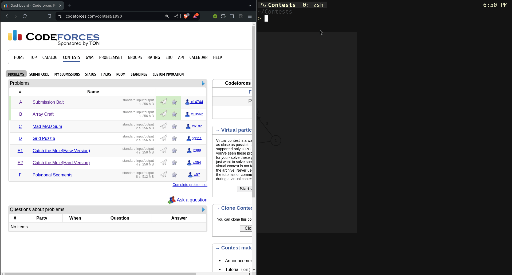

# cfget

Get problems from Codeforces via Competitive Companion.



This is my personal cli-tool and I have not designed it to be user-friendly
for anyone but me.

But, if you want to try it you free to do so!

## Installation

1. Clone the repository:

   ```sh
   git clone https://github.com/yourusername/cfget.git
   cd cfget
   ```

2. install the necessary dependencies:

   ```sh
   npm install
   ```

3. Link the package globally to use the `cfget`command:

   ```sh
   npm link
   ```

4. Make `cfget.js` executable

   ```sh
   chmod +x cfget.js
   ```

## Usage

Ensure that you have the Competitive Companion browser extension installed
and running.

Start the server by running

   ```sh
   cfget
   ```

Use `-d` or `--debug` flag to see json data.

   ```sh
   cfget -d
   ```

or

   ```sh
   cfget --debug
   ```

The problems will be saved in the current working directory with the following structure:

```txt
.
├── a.cpp
├── b.cpp
├── ...
├── tests/
│   ├── a1 (input files for problem a)
│   ├── a2
│   ├── ...
│   ├── b1 (input files for problem b)
│   ├── b2
│   └── ...
```
